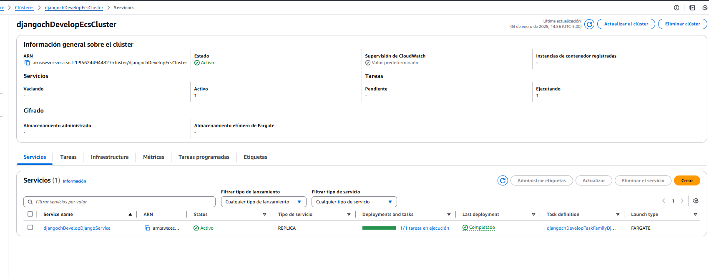
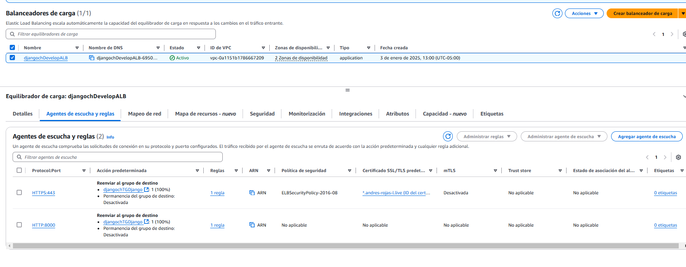
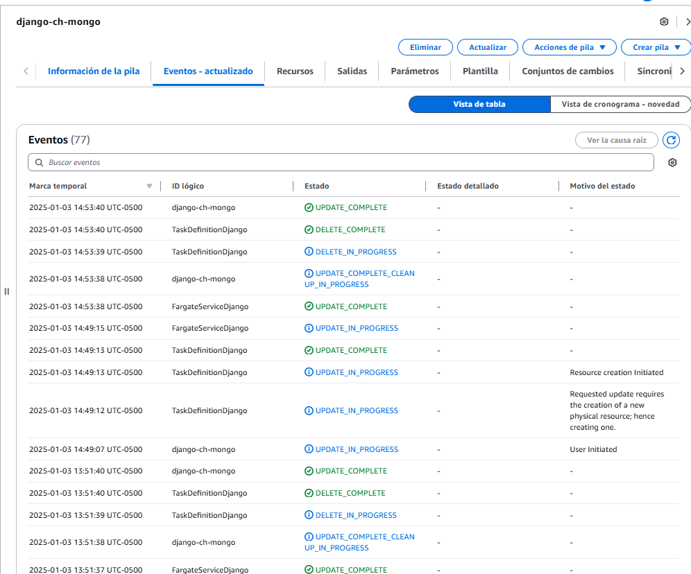
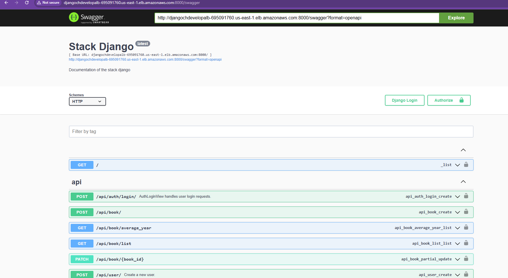
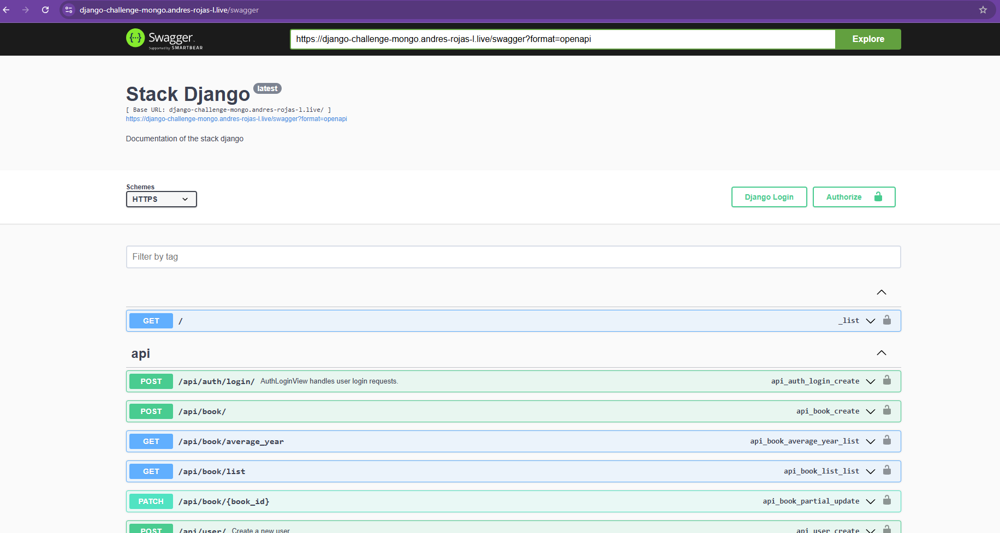
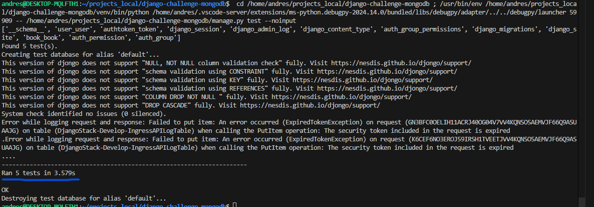
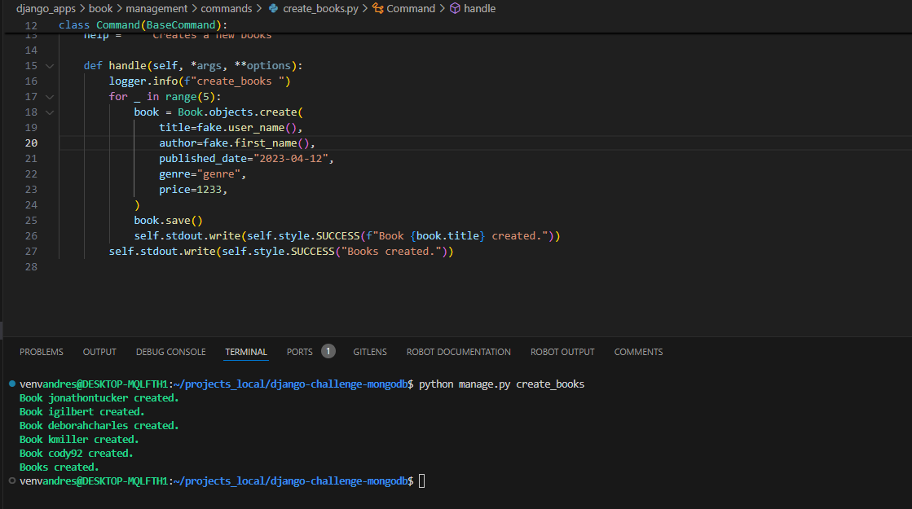

# Stack for Django MongoDB by Andres Rojas


## ALB PORT 8000
- http://djangochdevelopalb-695091760.us-east-1.elb.amazonaws.com:8000/

## Dominio
- https://django-challenge-mongo.andres-rojas-l.live/swagger


## ⚙️ Correr proyecto con Docker

Creacion del .env a partir del .env-example


1. Asegúrate de haber configurado el archivo `.env` en la raíz del proyecto.

2. Construye las imágenes de Docker:
   ```bash
   docker-compose build
   ```

3. Inicia los contenedores:
   ```bash
   docker-compose up
   ```


## 🌐 Despliegue AWS

### Creación de ECR para imágenes Docker


### Ejecución exitosa de CodePipeline


### Load Balancer activo


### Tarea ECS Fargate ejecutada exitosamente


### CloudFormation ejecutado exitosamente


### Acceso al Load Balancer en el puerto 8000



### Acceso al dominio


### Test Success



### Ejecucion comando que crea books


### Mongo local books


# Build Fargate

- Error windows push ecr
    - https://stackoverflow.com/questions/60807697/docker-login-error-storing-credentials-the-stub-received-bad-data
        - Remove file docker-credential-wincred.exe C:\Program Files\Docker\Docker\resources\bin
        - Remove "credStore""credsStore"C:\Users\PROFILE_NAME\.docker\config.json
            - C:\Users\andre\.docker
    - O:\AA-DOWNLOAD-D\resources\bin


docker build --no-cache -t django-mongo:v1 .

- Probar local
    - docker run -p 8000:8000 django-mongo:v1


## Consideraciones

- Como implemente el proyecto en una capa gratuita de mongo, esta conexion se cierra muy rapido.

